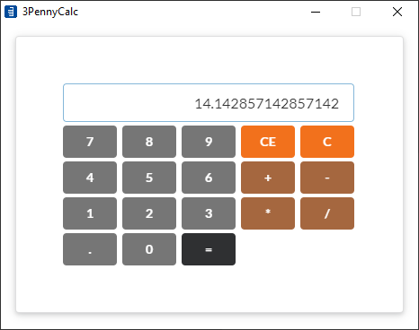

# Writing Haskell native GUI Applications with Threepenny GUI and Electron.

## Immature support for writing Desktop Applications in Haskell ?

Since reading The GUI chapter in [Real World Haskell](http://book.realworldhaskell.org/read/gui-programming-with-gtk-hs.html) 
I had the impression that Haskell does not excel in GUI programming.
The GUI examples in Real World Haskell are based on  [gtk2hs](https://github.com/gtk2hs/gtk2hs). Gtk2hs is a Haskell library that allows to write 
platform-independent GUI applications based on the GTK library.
There are some large applications based on gtk2hs or its successor [gi-gtk-hs](https://github.com/haskell-gi/gi-gtk-hs) like the 
Haskell IDE [Leksah](http://leksah.org/). It's rock solid technology. But it's also quite dated and the imperative programming model 
is not an ideal fit for a purely functional language like Haskell.

So even though I'm a Haskell enthusiast I tended to agree with [Gabriel Gonzales "Immature" rating](https://github.com/Gabriel439/post-rfc/blob/master/sotu.md#standalone-gui-applications) 
of Haskell's support for standalone GUI Applications.  

## Threepenny to the rescue
A few weeks back I was asked to write a standalone GUI version of an existing Haskell commandline app. So I had to make up
my mind about choosing a GUI library with an optimal fit to my needs:

- provide a multi-platform (Windows, MacOS, Linux) standalone GUI application.
- use functional reactive programming instead of event handler callbacks
- provide a modern look and feel e.g. material design

I never was satisfied with the look and feel of GTK based applications.
And I also wasn't keen on going back to callback based UI programming.
So I had a look at Gabriel Gonzalez great resource 
[State of the Haskell ecosystem](https://github.com/Gabriel439/post-rfc/blob/master/sotu.md).

In the [section on Standalone GUI applications](https://github.com/Gabriel439/post-rfc/blob/master/sotu.md#standalone-gui-applications) 
he mainly mentions GTK and Qt bindings but also some other libraries.
One of them is [Threepenny GUI](http://wiki.haskell.org/Threepenny-gui) which caught my attention because it uses 
the web browser as a display. And it comes with an (optional) functional reactive programming model!

> A program written with Threepenny is essentially a small web server that displays the user interface as a web 
> page to any browser that connects to it. You can freely manipulate the HTML DOM and handle JavaScript events 
> from your Haskell code.
>
> (Quoted from the  [hackage documentation](https://hackage.haskell.org/package/threepenny-gui))

My next thought was: It would be cool to use [Electron](https://electronjs.org/) to host the Threepenny HTML/Javascript 
frontend against the Threepenny Haskell backend. By making use of the [electron packager](https://www.npmjs.com/package/electron-packager) 
this would allow to package platform specific standalone GUI application for Windows, MacOS and Linux. 

I really got excited when I found out that Heinrich Apfelmus (the autor of Threppenny GUI) already had already  written a short 
[HOWTO document](https://github.com/HeinrichApfelmus/threepenny-gui/blob/master/doc/electron.md) that 
explains the required steps to glue an ELectron frontend to a Threepenny backend.

Based on this Howto I was able to deliver a native windows GUI Application with an embed Haskell backend within just a few days.
I received very good feedback from the endusers and my impression was:

>"Thanks to Threepenny GUI support in Haskell has just become a bit more mature!"

As I did not find much coverage of this specific Electron / Threepenny GUI combination in blogs or tutorials I thought it 
would be a good idea to spread the word by writing a short tutorial featuring the basic building blocks of this approach.

So without further ado let's get started:

## Writing a platform independent standalone calculator app

In order to provide a bit more than just a hello world example I'm showcasing a simple pocket calculator app. This allows to demonstrate basic features of writing real world UI applications. 

The UI of the calculator is shown in the screenshot below. It features a display, a numeric block for entering digits and a decimal point, buttons for the four basic arithmetical operations, a **clear** button and a **clear error** button:

### The calculator

At the heart of the application is the model. In this case the [calculator](src/Calc.hs). It is implemented as a simple state machine.

## WIP
----

The Calculator example is based on 
https://bitbucket.org/astynax/threep/src/default/

- fixed issue with entering fraction digits
- extended calculator functions
- added semantic.css stylesheet
- provided Electron integration which allows to generate standalone Desktop app from a Threepenny app

electron integration:
https://github.com/HeinrichApfelmus/threepenny-gui/blob/master/doc/electron.md

howto:

- npm install
- npm start   // this will also do a 'stack install --local-bin-path build' to build the haskell app

npm install

npm install electron-packager

./node_modules/.bin/electron-packager .

./node_modules/.bin/electron-packager . --ignore=app --ignore=src
